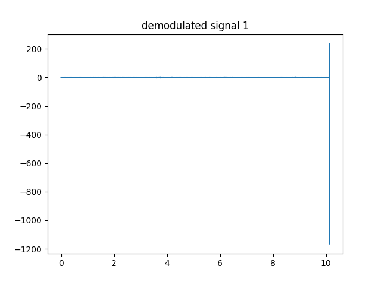

# Voicey
Voicey is a project for modulating and demodulating three audio signals by the following formula
```bash
s(t) = x1(t)cos(ω1*t)+ x2(t)cos(ω2*t)+ x3(t)sin(ω2*t)
```
to simulate sending and receiving signals through channels.<br/>
QAM and DBSC techniques are used to solve this problem.
## Signals plots in frquency and time domains
Frequency domain |  Time domain
:-------------------------:|:-------------------------:
 | 

## Original Vs demodulated signals
0 degree phase shift:
original signal |  demodulated signal
:-------------------------:|:-------------------------:
 | 
 | 
 | 


30 degree phase shift:
original signal |  demodulated signal
:-------------------------:|:-------------------------:
 | 
 | 
 | 

90 degree phase shift:
original signal |  demodulated signal
:-------------------------:|:-------------------------:
 | 
 | 
 | 
